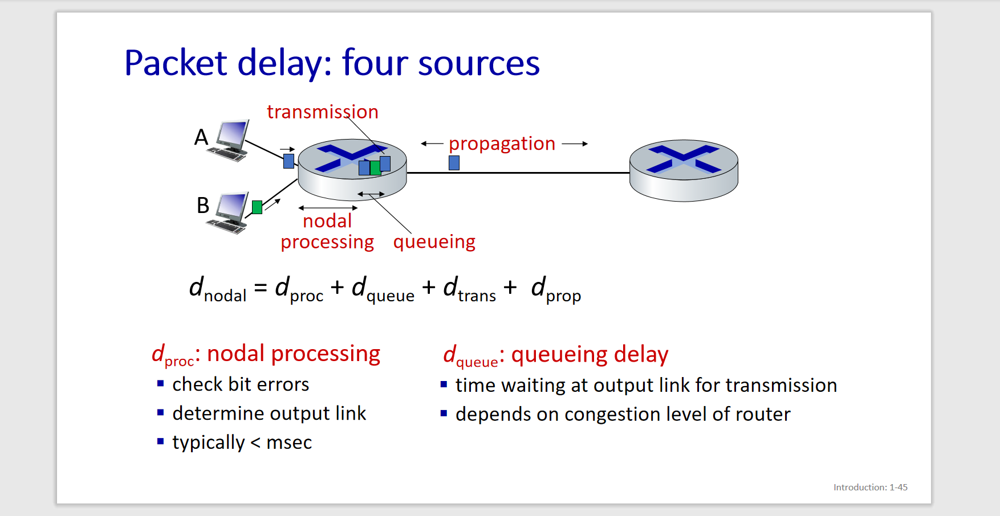
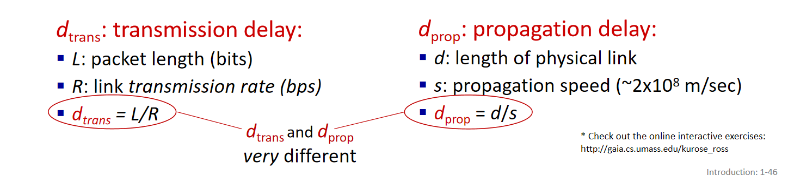
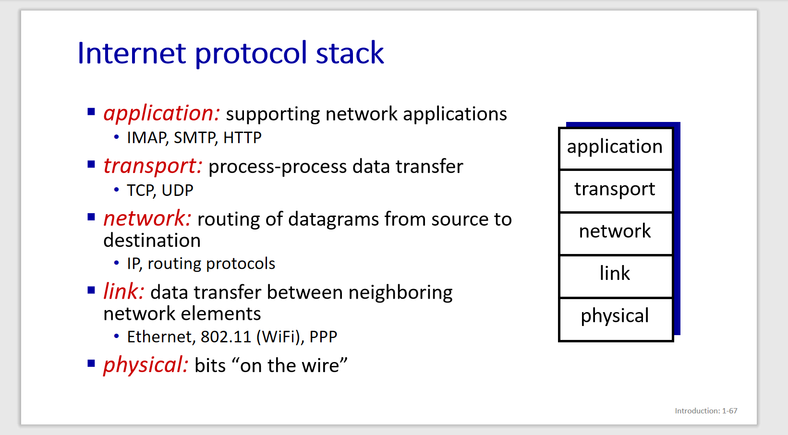
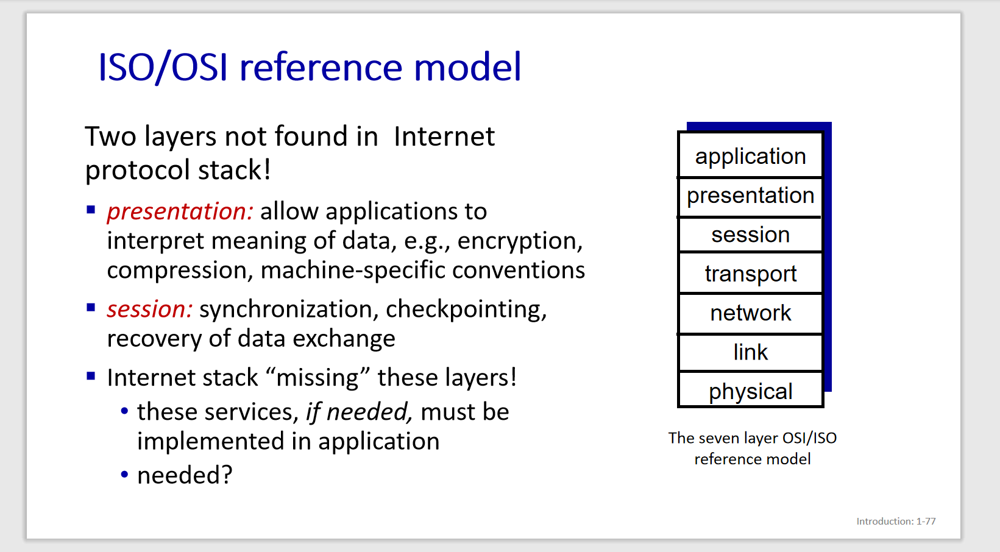

# 计算机网络

## 互联网内的各项构成(组件角度)

### 1. billions of hosts = end systems ：running network apps at Internet‘ s edges

主机也叫端系统

Packet switches (分组交换机)

### Communication links (通信链路):

- fiber,copper,radio,satellite
- and transmission rate: bandwidth
- 双绞铜线 光纤，卫星等都是

### Networks：

- collection of devices, routers, links: managed by an organization

​	包含着设备，路由器，各个链路，通常由一个组织运营着。

### Internet :network of networks

​	Interconnected ISPs (Internet Service Provider, ISP)

### protocols 

- control sending, receiving of messages
- e.g. HTTP(web) streaming video, Skype, TCP, IP, WiFi, 4G, Ethernet

Protocols defines the format, order of  messages sent and received among network entities, and actions taken on message transmission, receipt.

### Internet standards

- RFC: Request for Comments
- IETF: Internet Engineering Task Force

## 服务器角度的Internet

- Infrastructure that provides services to applications
- provides programming interface to distributed applications

Network edges:

- hosts: clients and servers
- servers often in data centers

Access networks , physical media:

- like wired, wireless communication links

Network core:

- interconnected routers

- network of networks

Access networks: 接入网 means link edge systems to the first edge router
由 DSL，电缆，FTTH，拨号，卫星这几种方式。

最普遍的还是数字用户线(Digital Subscriber Line，DSL) and 电缆

用户通过本地电话接入当地ISP。用的是双绞铜线。用的就是已有的本地电话基础设置。

电缆是利用的有线电视基础设施。

FTTH是光纤到户

然后传输数据，有两种方式
- 电路交换 circuit switching
- 分组交换 packet switching
  
电路交换有两类，FDM(频分复用)和TDM(时分复用)
然后主要还是分组交换更多

packet switching：store-and-forward
- Transmission delay: takes L/R seconds to transmit (push out) L-bit packet into link at R bps
- Store and forward: entire packet must  arrive at router before it can be transmitted on next link
- End-end delay: 2L/R (above), assuming zero propagation delay (more on delay shortly)

queueing delay,loss
Packet queuing and loss: if arrival rate (in bps) to link exceeds transmission rate (bps) of link for a period of time:
- packets will queue, waiting to be transmitted on output link 
- packets can be dropped (lost) if memory (buffer) in router fills up

packet loss and delay occur?

  - packets queue, wait for turn
  - arrival rate to link (temporarily) exceeds output link capacity: packet loss

#### Network Secuity
malware can get in host from:
- virus: self-replicating infection by receiving/executing  object (e.g., e-mail attachment)
- worm: self-replicating infection by passively receiving object that gets itself executed

layering to deal with complex systems

